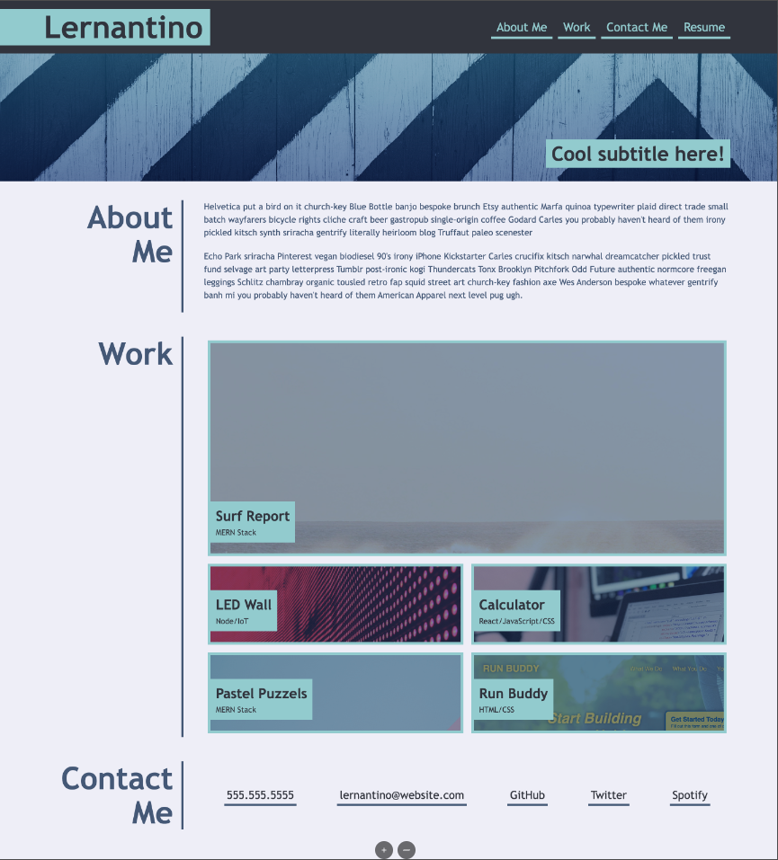
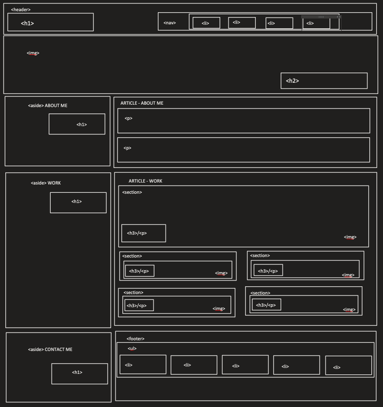

# challenge-2
[Deployed Application]()
[GitHub Repository](https://github.com/mthomsn/challenge-2)

## Description
The purpose of this challenge was to recreate a given webpage using HTML and CSS. I first planed out what elements needed to be included and where they needed to be positioned by creating a wire frame  of the website in Google Slides.  The biggest challenge I faced was getting the website to scale to a different sized screen

## Wire Frame
This is the website I was tasked to recreate:

This is the wire frame I created:

## Deployed

## What I learned
I integrated [Agile Software Development](https://www.agilealliance.org/agile101/) into my process by delivering a working webpage and maintaining high quality communication through git commit messages, inline code comments, and this readme.

## Future Development
Once I have created another project, add it into work section with link to deployed site.
 Make CSS more responsive to various screen sizes.

## Credits
Thanks to [Nicolas Gallagher](https://github.com/necolas) for providing [normalize.css](https://necolas.github.io/normalize.css/).

Thanks to the University of Texas and instructor Leah Nelson for providing challenge and challenge materials.

## Contact Me
Email: [matthewthomsen99@gmail.com](mailto:matthewthomsen99@gmail.com?) 
Github: [mthomsn](https://github.com/mthomsn)