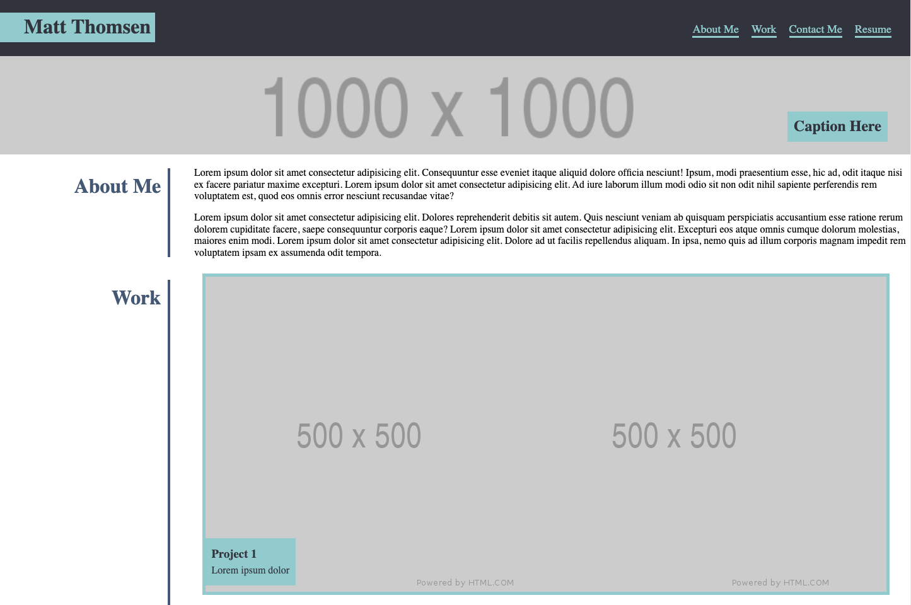
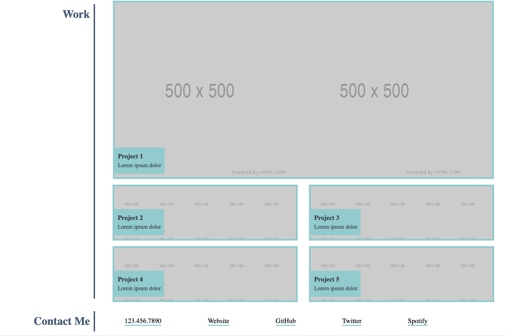
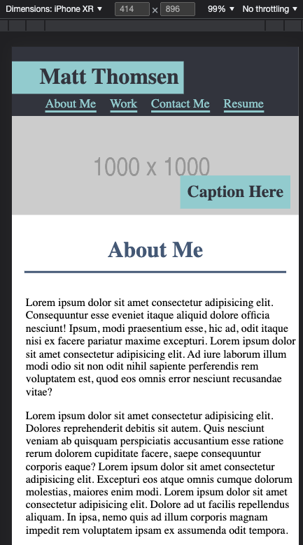
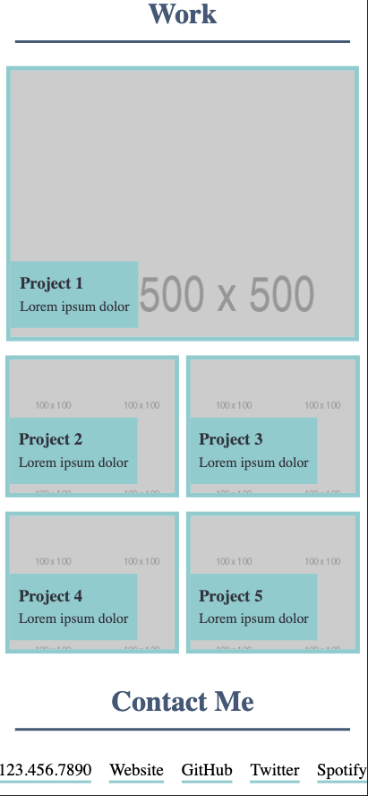

# challenge-2
#### __[Deployed Application](https://mthomsn.github.io/challenge-2/)__ 
#### __[GitHub Repository](https://github.com/mthomsn/challenge-2)__

## <u>Description</u>
The purpose of this challenge was to recreate a given webpage using HTML and CSS. I first planed out what elements needed to be included and where they needed to be positioned by creating a wire frame  of the website in Google Slides.  The biggest challenge I faced was getting the website to scale to a different sized screen.

## <u>Deployed and Usage</u>
I created this website for two main viewing dimensions:   
### __Desktop 1446 x 1399__  
 
  
### __Mobile iPhone XR 414 x 896__  
 
  

## <u>Wire Frame</u>

## <u>What I learned</u>
I integrated [Agile Software Development](https://www.agilealliance.org/agile101/) into my process by delivering a working webpage and maintaining high quality communication through git commit messages, inline code comments, and this readme.

## <u>Future Development</u>
Once I have created another project, add it into work section with link to deployed site.
 Make CSS more responsive to various screen sizes.

## <u>Credits</u>
Thanks to [Nicolas Gallagher](https://github.com/necolas) for providing [normalize.css](https://necolas.github.io/normalize.css/).

Thanks to the University of Texas and instructor Leah Nelson for providing challenge and challenge materials.

## <u>Contact Me</u>
Email: [matthewthomsen99@gmail.com](mailto:matthewthomsen99@gmail.com?) 
Github: [mthomsn](https://github.com/mthomsn)